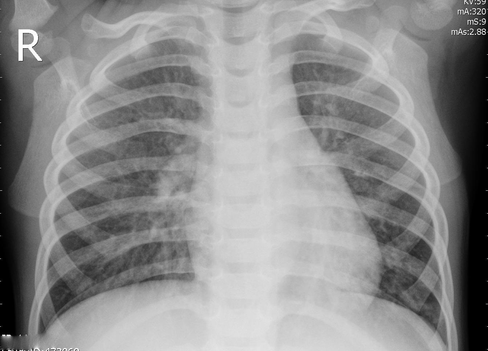

# Lung Diseases Classification model on Chest Radiograph.
This project aims to classify 3 lung diseases from chest radiograph using swin transformer. 
This project was developed by Chaichanok Angchanphen from AI-Builders: Majestic-eagles.

  

## How to Use
To get started, install the required dependencies by simply running these following commands:
> `pip install -r requirements.txt`

## Blog
I have written a blog post about this project on Medium.
For futhermore information you can check it out [here](https://medium.com/@chaichanok05/swinlung-swin-transformer-lung-diseases-classification-model-on-chest-radiograph-4bb4f0cea938).

## Deployment
This project has been deployed on streamlit cloud. You can access it through [here](https://swinlung-annbjm5nov3ca8bj3ctmgc.streamlit.app/)
